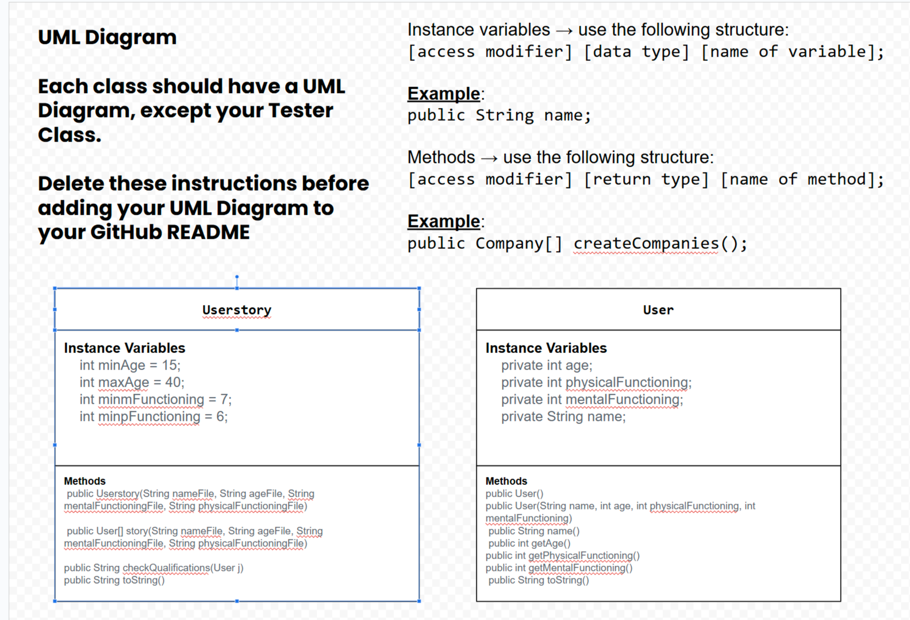

# Unit 3 - Data for Social Good Project 

## Introduction 

Software engineers develop programs to work with data and provide information to a user. Each user has different needs based on the information they are looking for from data. Your goal is to create a data analysis program for your user that stores and analyzes data to provide the information they need. 

## Requirements 

Use your knowledge of object-oriented programming, one-dimensional (1D) arrays, and algorithms to create your data analysis program: 
- **Write a class** – Write a class to represent your user or business and store and analyze their data with no-argument and parameterized constructors. 
- **Create at least two 1D arrays** – Create at least two 1D arrays to store the data that your user needs information about. 
- **Write a method** – Write a method that finds or manipulates the elements in a 1D array to provide the information your user needs. 
- **Implement a toString() method** – Write a toString() method that returns general information about the data (for example, number of values in the dataset). 
- **Document your code** – Use comments to explain the purpose of the methods and code segments and note any preconditions and postconditions. 

## User Story 

Include your User Story you analyzed for your project here. Your User Story should have the following format: 

> As an [FIA Licensing Official],   
> I want to [analyze whether or not a person is fit to own an F1 professional driver's license.],   
> so that I can [make sure a person is qualified to continue or start racing in F1 keeping peoples entertainment safe with minimum chance of danger]. 

## Dataset 

Include a hyperlink to the source of your dataset used for this project. Additionally, provide a short description of each column used from the dataset, and the data type. 

Example: 

Dataset: https://docs.google.com/spreadsheets/d/1Uo7_RRU7n1Jn7isuyKV-eTD-cIk7c0vXK-KvJTKozv0/edit?usp=sharing
- **Name** (String) - name of the person 
- **Age** (int) - Age of the person 
- **Physical functioning ** (int) - persons physical functioning level. 
- **Mental functioning ** (int) - persons mental functioning level. 

## UML Diagram 

Put and image of your UML Diagram here. Upload the image of your UML Diagram to your repository, then use the Markdown syntax to insert your image here. Make sure your image file name is one work, otherwise it might not properly get display on this README. 

 

## Description 

Write a description of your project here. In your description, include as many vocab words from our class to explain your User Story, the chosen dataset and how your project addressed that users goals. If your project used the Scanner class for user input, explain how the user will interact with your project.

In this project, I created a code that can turn a 1D array into a text file, read this array, and analyze it with an if statement. This project was made to help with my user story. My story as a FIA Licensing Official needs to make sure that each driver applying for their liscense is of proper age, mental fuctioning, and physical functioning. The data set was personally created to give an integer for age, physical functioning, and mental functioning each assigned to a String known as name to keep track of whose data is whose. Each of these columns was then turned into arrays printed out and run through a qualification check of if statements to check who is qualified to earn an F1 driver's license. 